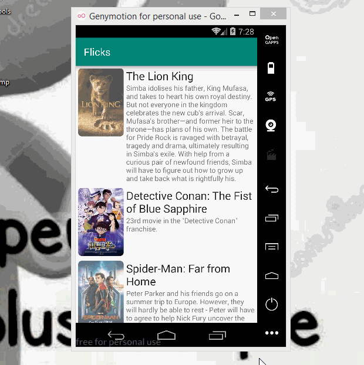

# Projet 2 - * FLicks *

** Flicks** affiche les derniers films en cours de lecture dans les cinémas. L'application utilise l'API de base de données de films pour afficher des images et des informations de base sur ces films à l'utilisateur.

Temps passé: **72** heures au total

## Histoires d'utilisateurs

La fonctionnalité ** requise ** suivante est terminée:

* [x] L'utilisateur peut ** faire défiler les films actuels ** à partir de l'API de base de données de films.

Les fonctionnalités ** stretch ** suivantes sont implémentées:

* [] Pour chaque film affiché, l'utilisateur peut voir les détails suivants:
  * [x] Titre, image du poster, vue d'ensemble (mode portrait)
  * [x] Titre, Image de fond, Aperçu (mode Paysage)
* [] Affiche un joli graphique [espace réservé] par défaut (https://guides.codepath.org/android/Displaying-Images-with-the-Glide-Library#advanced-usage) pour chaque image lors du chargement.
* [x] Permettre à l'utilisateur d'afficher les détails du film, y compris les cotes et la popularité, au sein d'une activité distincte.
* [x] Amélioration de l'interface utilisateur en expérimentant le style et la coloration.
* [] Appliquez des coins arrondis pour l’affiche ou les images d’arrière-plan à l’aide de [Transformations Glide] (https://guides.codepath.org/android/Displaying-Images-with-the-Glide-Library#transformations).
* [] Appliquez la célèbre [bibliothèque d'annotations Butterknife] (http://guides.codepath.org/android/Reducing-View-Boilerplate-with-Butterknife) pour réduire le code passe-partout.
* [] Autorisez la lecture de bandes-annonces vidéo en plein écran à l'aide de YouTubePlayerView à partir de l'écran de détails.

Les fonctionnalités ** supplémentaires ** suivantes sont implémentées:

* [] Énumérez tout ce que vous pouvez faire pour améliorer les fonctionnalités de l'application!

Procédure vidéo ##

Voici un aperçu des histoires d'utilisateurs implémentées:

GIF créé avec [LiceCap] (http://www.cockos.com/licecap/).

## Remarques

Décrivez les difficultés rencontrées lors de la création de l'application.

## Bibliothèques Open-Source utilisées

- [Android Async HTTP] (https://github.com/loopj/android-async-http) - Requêtes HTTP asynchrones simples avec analyse JSON
- [Glide] (https://github.com/bumptech/glide) - Bibliothèque de chargement et de mise en cache d'images pour Android

## Licence

    Copyright [yyyy] [nom du titulaire du droit d'auteur]

    Sous licence Apache, version 2.0 (la "Licence");
    vous ne pouvez utiliser ce fichier que conformément à la licence.
    Vous pouvez obtenir une copie de la licence à l'adresse

        http://www.apache.org/licenses/LICENSE-2.0

    Sauf si requis par la loi applicable ou convenu par écrit, les logiciels
    distribué sous licence est distribué "TEL QUEL",
    SANS GARANTIES OU CONDITIONS D'AUCUNE SORTE, expresse ou implicite.
    Voir la Licence pour le langage spécifique régissant les autorisations et
    limitations en vertu de la licence.